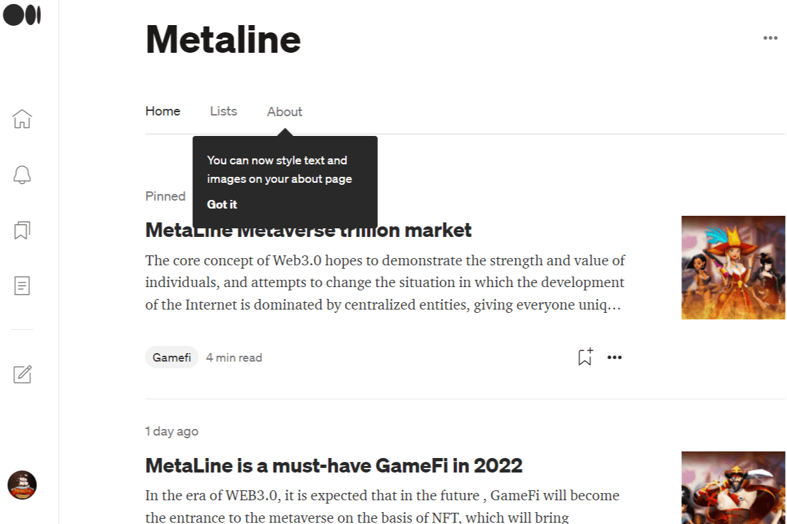

# MetaLine

MetaLine是一款远洋贸易游戏，让用户可以从他们的业务中获利，例如国际贸易、航运、导航、物流和产品，新的 Italgraniti 高能瓷器提供五种充满活力的效果，传达了真正材料的所有精髓，并创造了一种原始的覆盖物，是当代建筑的理想表现媒介。 Metaline/Mega 表面有惊人的 160x320、120x260 厘米尺寸可供选择，所有尺寸均为 6 毫米的超薄厚度。这些具有金属效果的巨大模块通过消除安装接头的限制网格，增强了室内设计方案的美感。

1. MetaLine：游戏

2. 英文：MetaLine 是一款远洋贸易游戏，让用户可以从国际贸易、航运、航海、物流、产品加工等业务中获利。用户可以组建船队，将产品运送到不同的港口，享受航海和贸易的乐趣。

   
