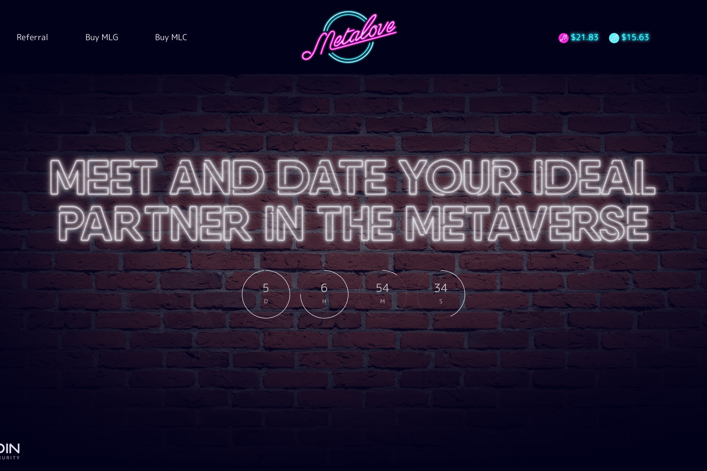

# MetaLove

Meta Love BSC 顾名思义，是 Metaverse 和 Love 的结合。
在我们的星球上，许多高度相容的人永远不会见面，仅仅是因为他们不知道可以与之分享生活的人的存在......
出于这个原因，我们构建 Meta Love 的目的是让许多人可以在元宇宙中相遇和约会，我们希望他们中的许多人无论目前居住在哪里都能找到爱情。
整个团队都在努力使匹配算法尽可能准确，以便高度匹配的人可以匹配并开始见面。
元界
在我们的元宇宙中，一旦您与您“匹配”了一个高度兼容的人，您就可以立即开始聊天。
但与传统约会APP不同的是，你可以在虚拟世界中进行真实的约会，比如在虚拟世界的豪华餐厅约会，或者租一辆豪华汽车到他们家接你的“火柴”。
无论您在地球上的实际位置如何，我们都希望如此。您可以像彼此相邻一样体验这种体验。
如果您在我们的虚拟世界中坠入爱河，您还可以庆祝您的婚礼，我们希望能陪伴您。
你一生的挚爱可能在我们的虚拟世界，你敢见她/他吗？
秘密信使
在我们的元宇宙中，您将能够将对话 100% 保密，因为消息将被加密，并将通过智能合约进行交换，其中只有您（使用您的钱包）和与您聊天的人（以及他们的钱包） ) 将能够看到消息。

