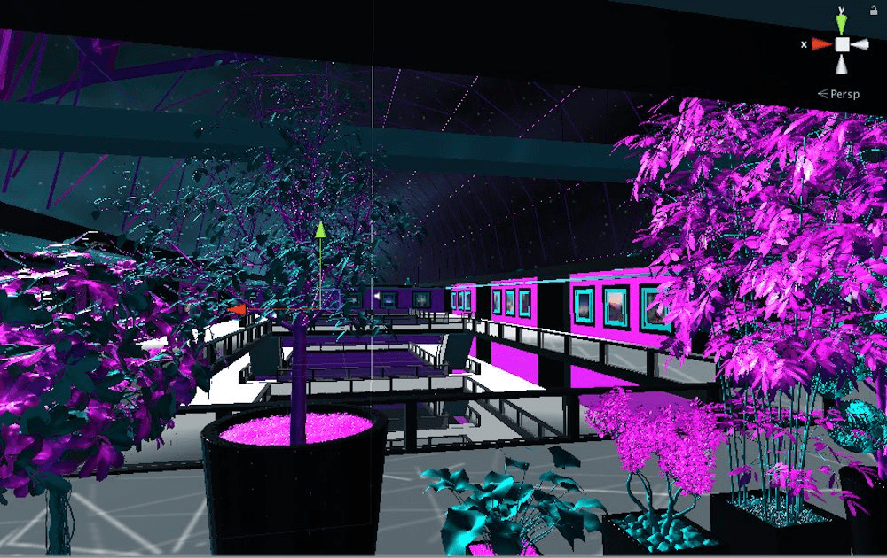

# Metaplex

M Ξ T A P L Ξ X 是一个实验性且不断发展的虚拟环境。它的脸，一个废弃的购物中心，作为一个主要枢纽，引导并打开了各种模拟/构造、游戏、互动代理、艺术品和体验，由分布在以太坊区块链网络上的 c/a+ 策划和创建。按照下面的链接，您可以前往 M Ξ T A P L Ξ X 商城，分别阅读有关构造的信息 [也可以通过跳过商城直接访问它们] 并购买各种数字物品和艺术品。最后，还有一个关于这个项目的简单入门指南和文档。虽然许多正在进行中，但目前有两个在线结构； A.I.F.X 和另一个Realiti。

