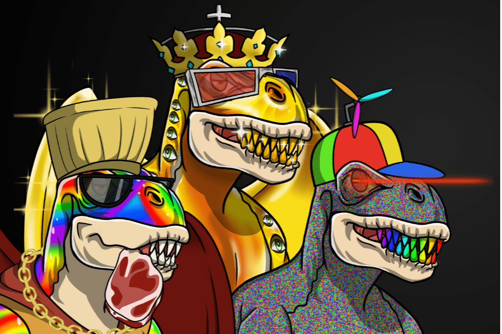

# Metasaurs by Dr. DMT

DMT 博士的 Metasaurs 是生活在以太坊区块链上的 9,999 个独特的 Metasaurs 的集合，这一次，永远......

我们很自豪能成为伙伴。

DMT 博士是谁？
我是来自无聊猿游艇俱乐部的正宗无聊猿，原名 BAYC Ape #4588。
‍
你以为那是我背心上的芥末？这实际上是我在实验室实验中的 MetaDNA 化学物质。我是一位元科学家，他对 9,999 条独特的元龙进行了基因工程。

你可以叫我DMT博士。

自从恐龙出现以来，已经有 6500 万年了。无聊的猿也需要同伴。 #BAYC #dmtgang #Metasaurs 可以生活在一起，也许我们作为一个社区在一起会不那么无聊。

我是如何创造 Metasaurs 的？见下文。

