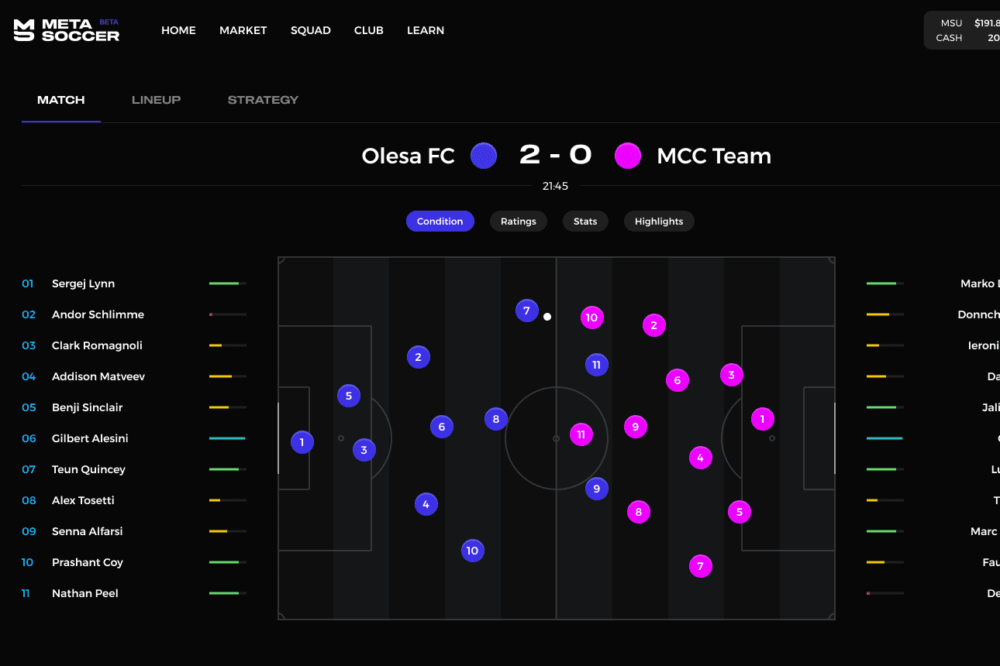

# MetaSoccer

MetaSoccer 是第一个基于区块链的足球元界。
在足球经理 Play-to-Earn 游戏的支持下，每个用户都可以以不同的方式积极参与，并通过他们对生态系统的贡献获得奖励。
作为所有者，用户将能够找到自己的俱乐部并负责财务管理、球员和员工的购买/销售、设施和商业协议......
作为经理，用户将通过管理球队、训练球员充分发挥他们的潜力和准备球队策略来沉浸在足球教练的角色中……
整个生态系统由 DAO 管理，$MSU 代币持有者将参与未来的决策。
通过对生态系统的贡献，您可以通过多种方式赚取 $MSU 代币。这些是其中一些：
出售被你的球探发现的球员。
随着您的球员越来越受欢迎，您可以获得赞助和商品收入。
在职业模式中与其他用户或在友好模式中与 AI 赢得比赛

拟）。
