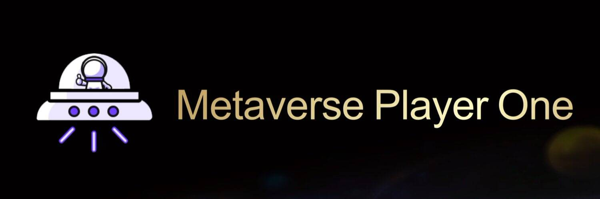

# Metaverse Player One

元界玩家一号是互联网行业基于NFT DeFi GameFi的新一代创意区块链，也成为第一个NFT+DeFi+GameFi的融合创作，让每一位玩家都准备好了玩家一号

密切关注 UI 改进和总体生活质量的变化。你有什么想法吗？在我们的 Discord、Telegram 和错误报告软件中分享。

Alpha 测试的目的是改进 Super Galactic 的正式发布。

阅读反乌托邦科幻小说是一种典型的魅力。一个人对未来的想象对我们很有吸引力。然而，最有趣的是，曾经的虚构可以变成现实。

欧内斯特·克莱恩 (Ernest Cline) 的一本名为“Ready Player One”的小说描绘了 2045 年的世界，全球变暖和能源危机正使世界陷入困境。这导致社会问题和经济停滞。

《Ready Player One》描绘了 2045 年的世界
唯一的逃脱 — 小说中 — 是一个名为 OASIS 的元宇宙，可以通过 VR 耳机和有线手套访问。 Metaverses 作为一个虚拟社会，人们可以在其中大量玩多人在线角色扮演游戏。

最初，元节这个词是在 1992 年尼尔斯蒂芬森的科幻小说《雪崩》中创造的。斯蒂芬森将其描述为基于虚拟现实的互联网继任者。 Snow Crash 描绘了一个虚拟世界，其中人类在使用现实世界隐喻的 3D 虚拟空间中作为化身进行互动。

谁能想到，30多年后，元宇宙开始变得真实了！ 2021 年 10 月，Facebook 宣布将公司名称更改为 Meta。这家社交媒体巨头决定专注于 Meta 作为他们的新公司品牌，这将使 Metaverse 栩栩如生，并帮助人们建立联系、寻找社区和发展业务。

元界作为一个概念对 Facebook 来说是有意义的，因为 Facebook 已经通过一个临时的社交媒体社会来代表在线用户。通过转型为 Meta，该公司将在线社交体验扩展到三个维度或投射到物理世界中。

元宇宙到来的下一步是什么？
提供另一种数字宇宙，元宇宙能够更新我们的生活、工作和娱乐方式。它是我们物理生活和数字生活的融合。我们实际上正在拥抱现实世界中的增强现实 (AR)、扩展现实 (XR) 和虚拟现实 (VR) 的互联网新阶段。

