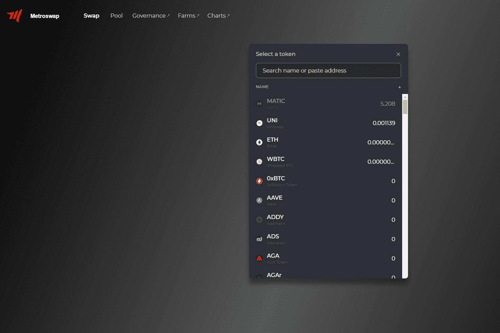

# Metroswap

用于在 EVM 兼容区块链上自动做市的区块链独立协议。保证数百万用户和数千个应用程序的流动性。 Metroswap 协议使开发人员、流动性提供者和交易者能够参与到一个对所有人开放且可访问的金融市场。

MetroSwap 是一种 AMM 协议。该协议是为去中心化交易所开发的。它可以在与 EVM 兼容的网络上使用。 MetroSwap 的主要目的是确保流动性。该项目旨在为开发商、流动性提供者（LP）和投资者提供一个开放且可访问的金融空间。

你刚刚在网上卖了那个被遗忘已久的物品吗？您是否正在寻找公共场所来交换此物品？您是否分享孩子的监护权并正在寻找交换监护权的地方？路易斯维尔地铁警察局正在城市周围提供 MetroSWAP 区域。这些区域位于我们的某些部门之外。有24小时视频监控。

