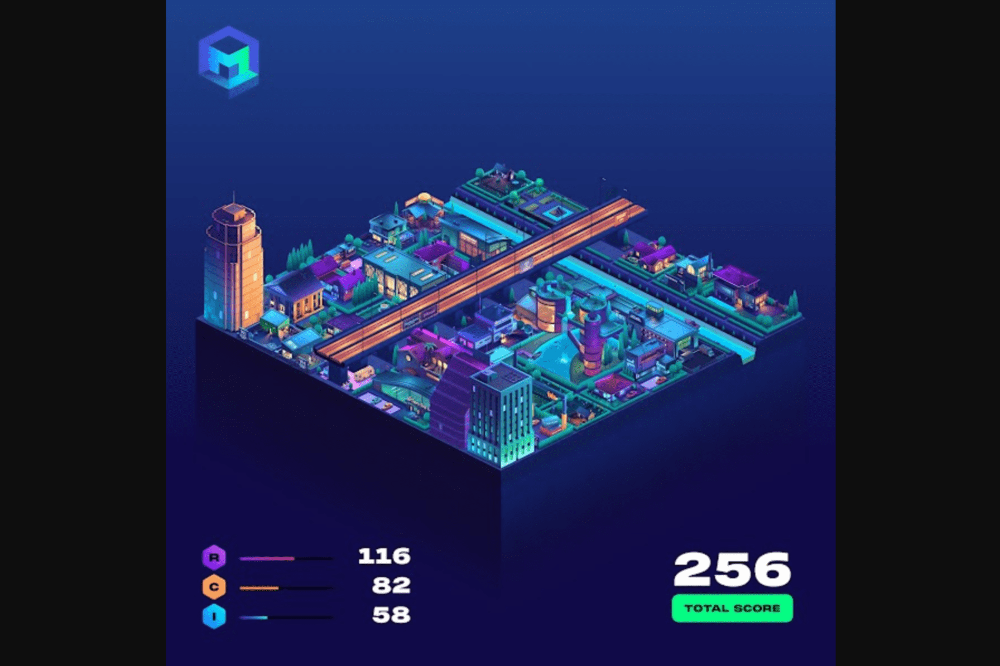

# Metroverse

Metroverse 是一款基于以太坊的土地交易 NFT 策略游戏。收集、交易和抵押您的城市街区以获得 $MET 实用代币。
目前 94% 的城市街区都在 Metroverse Vault 中。 3840 个城市街区的独特所有者。 白名单铸币厂计划于 2022 年 5 月 10 日世界标准时间晚上 7 点进行。在世界标准时间 5 月 11 日晚上 7 点，MetroMorphosis 开始允许 Metro Pass 持有者使用他们交易的 1 个创世块铸造 10 个迷你块。世界标准时间 5 月 12 日晚上 7 点，通过荷兰式拍卖的 MET 铸币厂从一个上限（价格待定）开始，一直到每块 4k MET 的底价。

最大可铸币？
在白名单铸币期间，每个钱包可铸币的最大迷你区块数量为 2。在 MET 荷兰拍卖期间，每个钱包可铸币的最大数量没有限制。

