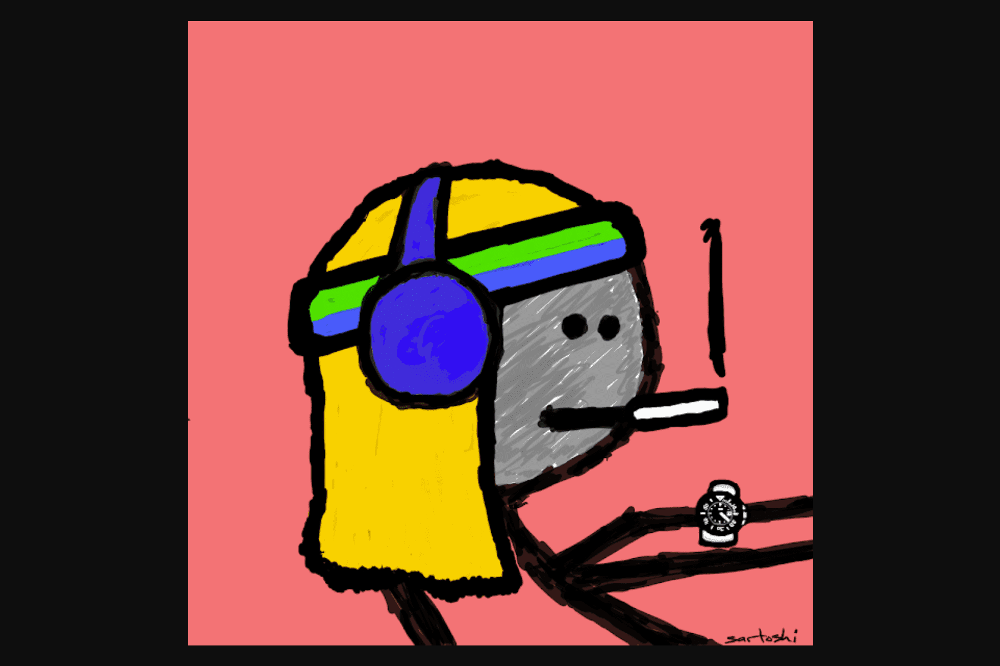

# mfers

我所设想的 mfer 世界将集中体现“我们都是 mfer”这一简单理念。没有国王、统治者或明确的路线图——mfer 可以用这些 mfer 构建他们能想到的任何东西。我不知道最终会是什么样子——这就是重点……没人知道。也没有官方不和谐。 mfers 然后创造了一个“官方非官方的不和谐”，现在有成千上万的成员做着非凡的事情，所以我听说了。我不在其中-这是设计使然。 mfer 在实验和构建时不需要 sartoshi 的批准或回头看。我认为对 mfer 持有者最有价值的东西是扩大他们的想法和创作的精华，以接触更多的观众……并在机会来袭时为持有者增加价值，包括与可能为其他 nft 创作的艺术家建立联系mfer 持有人索赔。

