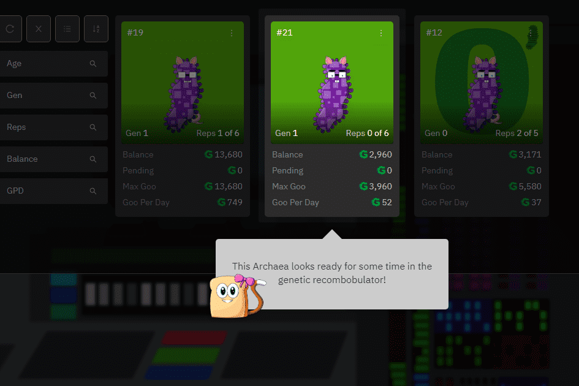

# MicroBuddies

MicroBuddies 是一款 NFT 策略游戏，大约有 10 种可爱、可爱的微生物，它们被动地产生一种名为 GOO 的虚拟货币。
与其他繁殖游戏不同，MicroBuddies 通过称为复制的过程进行无性繁殖。复制 MicroBuddy 需要 GOO，并且会创建一个新的下一代 MicroBuddy，其特征继承自其父代。
开发和利用您自己的创造性人工选择策略是产生更好和更稀有性状的关键。 MicroBuddy 的特性越好，它产生的 GOO 就越多（而且它看起来越酷！）。
前 2,500 个 MicroBuddies，称为第 0 代，是极其稀缺的一组 MicroBuddies，它们催生了游戏的其余部分。每个都有 5 次重复。

