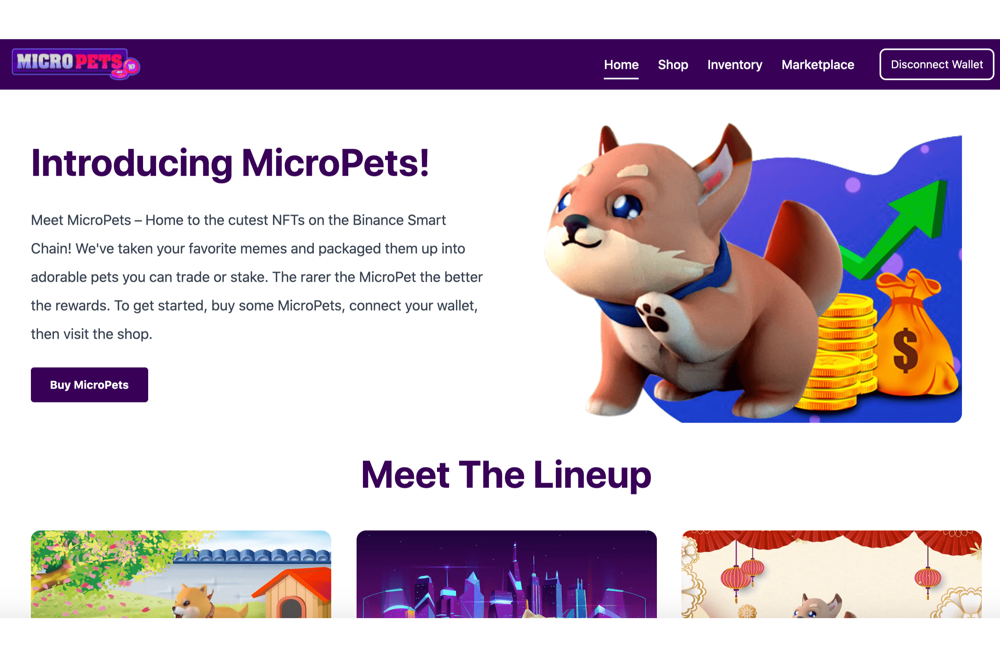

# MicroPETS

认识 MicroPets——币安智能链上最可爱的 NFT 的所在地！我们采用了您最喜欢的表情包，并将它们打包成可爱的宠物，您可以进行交易或质押。 MicroPet 越稀有奖励越好！
要玩，只需使用 MicroPets dApp 在我们的商店购买一个板条箱（第 1 天可用）。购买后，您将解锁六个随机 NFT 之一，每个 NFT 都有自己的稀有度和权益乘数。如果您喜欢您的 MicroPet，您可以在我们的质押池中质押他并获得奖励。想要别的东西吗？没关系，只需将您的 MicroPet 在我们的市场上出售！
MicroPets 从头开始构建以支持特别版 crate，支持从假日主题的 NFT 到基于加密领域当前炒作的一次性版本！这是什么意思？快速的周转时间和向社区提供的持续内容流。

