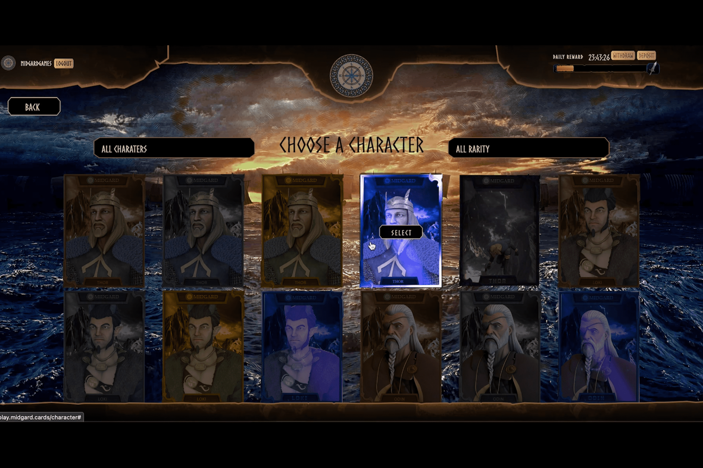

# Midgard Clash

Midgard Clash 是一款基于斯堪的纳维亚神话的 PvE 和 PvP 游戏。
游戏玩法
这个游戏的目标是在地牢中战斗以赚取
Yggdrasil 代币。在启动游戏时，它会打开一个
“登录”选项，这将是旅程的起点
米德加德。登录后，玩家必须选择
他们想玩的钱包。对于这个游戏，Wax
将使用云或锚点。
玩家必须从他们的武器中选择三种武器
将在整个持续时间内使用的武器箱
游戏环节。然后玩家可以选择角色
他们想带去地牢。
角色和武器属性将决定
玩家在每场比赛中获得的“攻击次数”
会议。选择持续时间的选项（6 小时、12 小时、
和 24 小时）接下来会弹出游戏。下一个画面
将显示一个计时器，开始倒计时所选
期间。
在选定的持续时间结束后，玩家将拥有
选择获得的 Yggdrasil 代币和 NFT 下降的选项
在每 24 小时结束时，点击右上角的“索赔”
屏幕一角。
玩家可以将他们的 Yggdrasil 代币提取到他们的钱包中，
当他们在游戏中达到 3.000 Yggdrasill 时。
如果用户在他们的帐户中保留 5.000 Yggdrasill 并且不
退出，他们将获得 %10 减少等待的奖励
游戏时间。
如果用户在他们的帐户中保留 10.000 Yggdrasill 并且不
退出，他们将获得 %20 减少等待的奖励
游戏时间。
玩家可以在一个游戏结束后重复整个游戏过程
持续时间。

