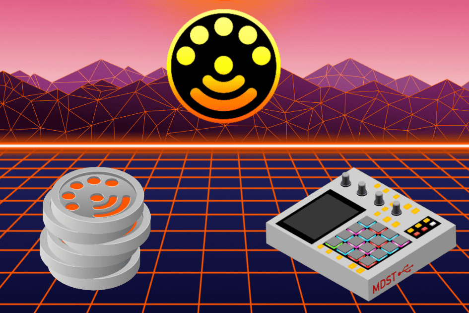

# Midi.Finance

用于购买 MDST 代币的 ICO WAVES 交换。其他可用资产
Midistream 基本上是由比利时程序员 Jean-Michel Dewez 的团队创建并在 SXSW 2018 黑客马拉松上发布的项目。该平台为音乐作曲家、表演者、混音师、声音设计师和音乐爱好者提供了一种新的方式来创建、销售、购买、播放具有多层次奖励系统的 midi 音乐，并计划托管全世界提供给混音的音乐。项目已成功在 kickstarter (2019) 上获得支持。 MDST 代币的创建是为了解决这个问题，以一种所有唱片公司都可以推动的不变方式奖励原创艺术家和混音师。然后，该解决方案被抽象为允许其他用途，不仅是 MIDI 音乐分发。

