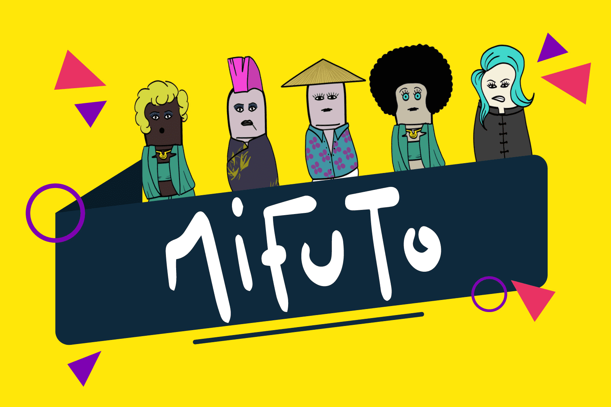

# MiFuTo MFT

MiFuTo 项目发挥了 NFT（Not Fungible Token）的概念，但使用 M 而不是 N，我们想在这种情况下回忆中指，中指这个词，我们不希望在 N 后面加上 NOT否定。中指是我们的滚蛋，不是无缘无故的，它是通过一种抗议的姿态进行的抗议滚蛋，它在插图中找到了它的艺术出口。

拥有您的 MFT，您可以：

超过 80% 的市场费用与持有人分摊

有资格获得生态系统代币空投 $MFT

获得 AVAX 生态系统的合作伙伴权益

拥有由艺术团队设计的独特 NFT

MIFUTO 的铸币者获得超过 20% 的铸币费，FCFS

总共 212 个手绘特征
92 种普通和稀有特性，以及 120 种传奇特性

