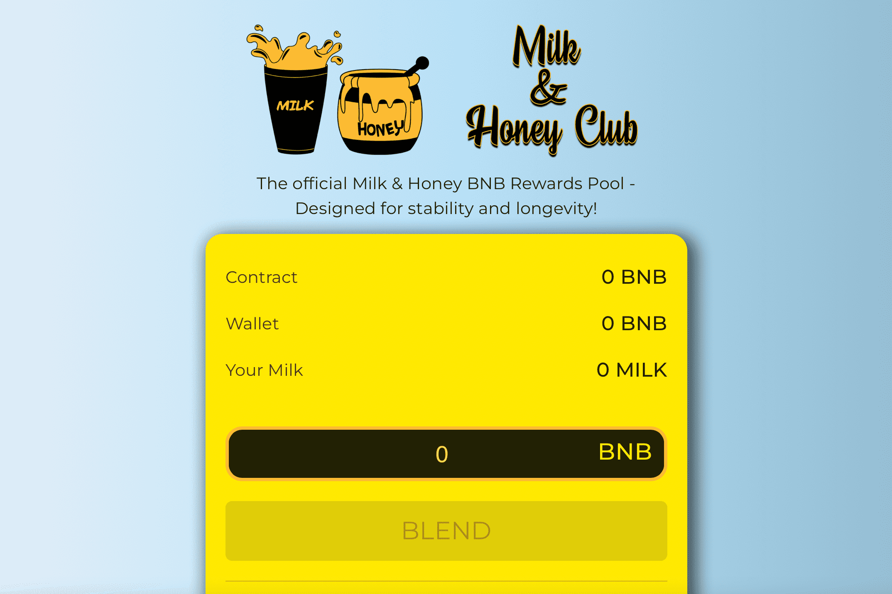

# Milk & Honey Miner

欢迎来到 🥛 和 🍯 俱乐部！
Milk & Honey BNB Miner - Milk & Honey 俱乐部的官方社区矿工！
该项目的重点是社区发展、矿池强度的持久性和矿池奖励的稳定性。开发者。团队实现这一目标的方法很简单。永远从外部来源添加更多 BNB，以帮助在市场下跌趋势期间为资金池提供资金。
我们如何做到这一点？
我们通过资本化（并实际利用）开发来做到这一点。收取的费用 (3%)。该团队正在探索创收机会，然后将收益以高于最初 3% 开发的速度反馈到池中。收取的费用。
从长远来看，这有什么作用？
简单的。增加稳定性并延长寿命。 😎
Milk & Honey 由多个聊天室和媒体门户组成。除此之外，该品牌经受住了时间的考验！从新成立的 CALL 房间，到超过 10k 会员的 Telegram 聊天，社区非常强大！ #defi 空间需要这种能量。社区是推动 Milk & Honey Miner 取得长期成功的动力！

  混合 = 存款 BNB（购买矿工）
  牛奶 = 矿工数量
  喝牛奶 = 领取当前奖励
  STORE HONEY = REROLL 当前奖励（购买更多矿工 W/奖励余额）

