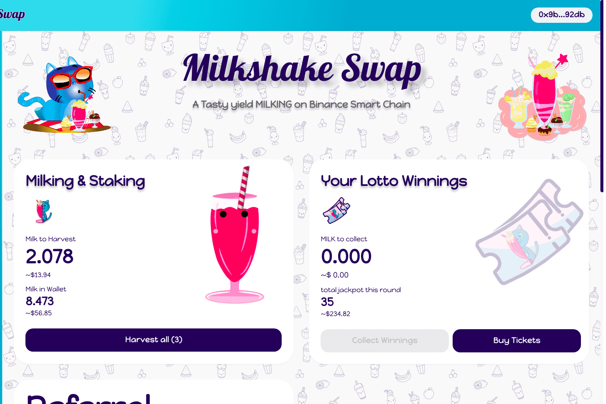

# MilkShakeSwap

MilkshakeSwap 是一种由 Binance 智能链驱动的 DEX 和 AMM，允许任何人高效安全地交换 BEP-20 代币。该平台可与 Uniswap 相媲美，因为它提供了与流动资金池相结合的去中心化交易体验。 MilkshakeSwap 可以成为币安智能链上最大的 Dapp，被许多人视为具有无限潜力的项目。因此，该平台非常受欢迎，目前锁定的流动性为 2,041,005.62 美元。
MilkshakeSwap 消除了所有这些担忧，因为它退出了以太坊生态系统的范围。币安智能链旨在简化所有这些操作，并为用户提供更具成本效益的替代方案。这一策略帮助该平台在 DEX 之间日益激烈的竞争中脱颖而出。
主要收益点：去中心化交易所、挤奶（农场）、风味池、LOTTO（彩票）、去中心化推荐

