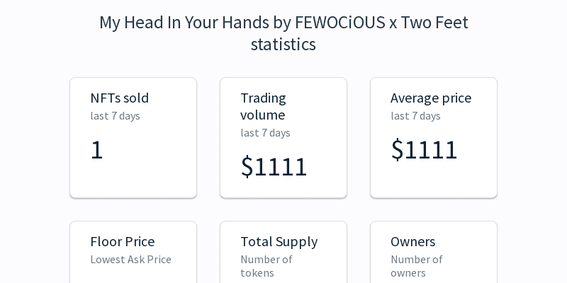

# My Head In Your Hands by FEWOCiOUS x Two Feet

FEWOCiOUS 是一位 18 岁的艺术家，出生并在内华达州的拉斯维加斯长大，由于课堂上的无聊，在中学时发现了他们对艺术的热爱。 FEWOCiOUS 决定画同龄人的漫画来打发时间。 他们的艺术已经成为他们处理成长过程的一种方式，并为另一种形式的日记服务。 Two Feet 是来自纽约布鲁克林的白金认证的多乐器演奏家和录音艺术家。 截至 2021 年，流媒体播放量超过 20 亿次，在从州长舞会到奥斯汀城市极限的所有舞台上都取得了胜利，出生于 #1 的另类电台词曲作者比尔·德斯（Bill Dess）在他职业生涯的短短几年内就令人印象深刻地在全球范围内建立了庞大的粉丝群。 除了他的音乐才能，比尔还是一位狂热的插画家，他经常在业余时间画画。

