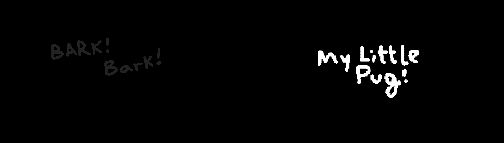

# My Little Pug

3333 吠 吠 吠 吠 吠 吠！ 路线图：BARK BARK BARK BARK，BARK BARK BARK BARK BARK ETH BARK。 树皮树皮-PUG

什么是我的小哈巴狗？
My Little Pug 是一个 NFT（非同质代币）集合。 存储在区块链上的数字艺术品集合。
▶ My Little Pug 代币有多少？
总共有 3,333 个 My Little Pug NFT。 目前，1,568 位车主的钱包中至少有一个 My Little Pug NTF。
▶ My Little Pug 最昂贵的促销活动是什么？
最昂贵的 My Little Pug NFT 是 My Little Pug #1860。 它于 2022-06-14（2 个月前）以 1.2 美元的价格出售。
▶ My Little Pug 最近卖出了多少？
过去 30 天内售出了 7 个 My Little Pug NFT。
▶ 什么是流行的 My Little Pug 替代品？
许多拥有 My Little Pug NFT 的用户还拥有 Little Ones NFT、NomNomSharks、fmfers 和 OkAI Bearz。
  交互式 NFT 项目：Goofball Gang。 立即购买。

