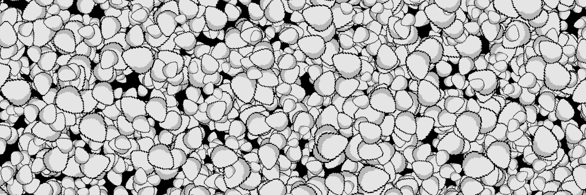

# My Pet Egg

当它们破裂和孵化时，请留意你的鸡蛋。 图片将在售罄后每 6 小时更换一次。 2 天后，您的蛋将完全孵化成... 👀

My Pet Egg NFT - 常见问题（FAQ）
▶ 什么是我的宠物蛋？
My Pet Egg 是一个 NFT（非同质代币）集合。 存储在区块链上的数字艺术品集合。
▶ My Pet Egg 代币有多少？
总共有 555 个 My Pet Egg NFT。 目前，99 位业主的钱包中至少有一个 My Pet Egg NTF。
▶ My Pet Egg 最近卖出了多少？
过去 30 天内共售出 0 个 My Pet Egg NFT。

