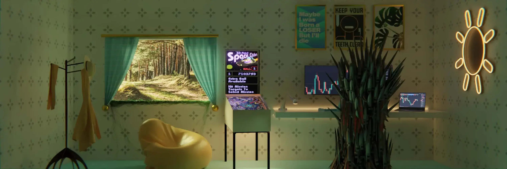

# My room My dream

PFP 即将推出 我的房间是 1000 名退化者的集合，他们从他们的宿舍“试图成功”，生活在以太区块链上。 我的房间是第一个带有 3D 艺术的 2 合 1 NFT，持有者将获得一个 PFP 和一个横幅，其中两个图像的氛围和氛围是相同的！

什么是我的房间我的梦想？
我的房间 我的梦想是一个 NFT（不可替代的代币）集合。 存储在区块链上的数字艺术品集合。
▶ 我的房间有多少我的梦想代币存在？
总共有 1,000 个 My room My Dream NFT。 目前 822 位业主的钱包里至少有一个 My room My dream NTF。
▶ 什么是最贵的 My room My Dream Sale？
最昂贵的 My room My Dream NFT 出售的是 My Room #572。 它于 2022-06-13（2 个月前）以 7.5 美元的价格售出。
▶ 我的房间我的梦想最近卖了多少？
过去 30 天内售出了 5 个 My room My Dream NFT。

