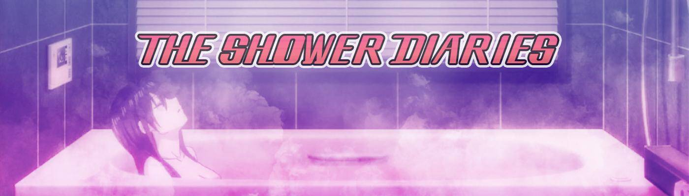

# My Shower Diaries

我们深入研究了 Akima 的日记，她是一位年轻女子，她发现了她对朋友的爱......跟随我们每隔几个小时更新一次。（当前阶段：第 1 阶段。每个阶段都会改变图像、音频和增加故事情节） .

什么是我的淋浴日记？
My Shower Diaries 是一个 NFT（非同质代币）集合。 存储在区块链上的数字艺术品集合。
▶ My Shower Diaries 代币有多少？
总共有 888 个我的淋浴日记 NFT。 目前，345 位业主的钱包中至少有一本我的淋浴日记 NTF。
▶ 最近卖出了多少本《我的淋浴日记》？
在过去 30 天内售出了 0 个 My Shower Diaries NFT。
▶ 什么是流行的“我的淋浴日记”替代品？
许多拥有 My Shower Diaries NFT 的用户还拥有 tiny roosters(eth)、Okay Duck Pixel Club、420MoonBird 和 Shroom Goons。
  交互式 NFT 项目：Goofball Gang。 立即购买。

