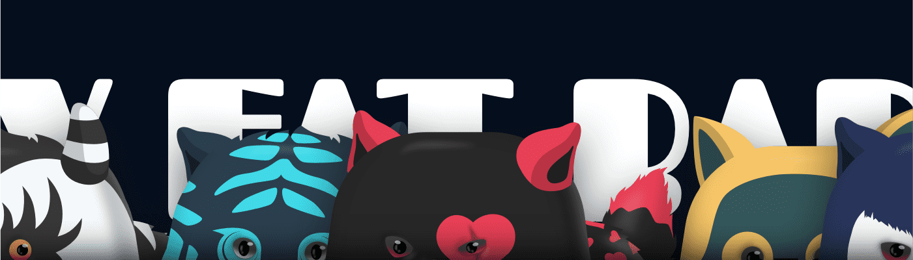

# My Fat Babiz OfficiaI

公开发售(S2) : 3/1 10pmMy Fat Babiz 是一个 NFT 项目，采用 PFP+Crypto Pet 的概念，在线拯救被遗弃的狗。 可以使用 Staking 和 Swap 在官方网站上进行代币挖掘。 由于 NFT 被质押，NFT 与合约绑定，并且所有者临时更改，因此上述所有者数量减少。 合约中的 Staking 和 Unstaking 仅由实际 NFT 所有者授权。 查看官网质押的 BABYZ 的 TVL 和 APR！MFB 是基于 klaytn 的独特加密宠物 NFT 集合。 Babiz 与预先设计的稀有度随机组合。 没有人知道哪个 Babiz 会出现。 Babiz 是一种被遗弃的加密宠物，类似于真正的狗。 如果您成为OG会员，您可以选择并铸造。 如果你有两个 Babiz，你可以通过繁殖获得一个婴儿 Babiz NFT。

