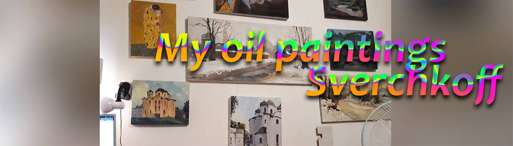

# My oil paintings Sverchkoff

我的油画只有 36 件 www.sverchkoff.ru / TWITTER / INSTAGRAM

经过图形从我的公寓看城市。 大诺夫哥罗德。 6 楼。 帆布，油。

经过图形雪中的人和鸟 / 塑料、油 / 2021
我的油画索引
Teresa Bernard 油画的视觉参考
艺术家 Teresa Bernard 的油画索引下面是我所有油画的视觉资源索引和参考。 如果你在这里没有看到你要找的艺术品，很可能它不是我的。 当然，这不是一个详尽的清单。 我从十几岁开始就开始画画了，早在互联网和这个网站的创建之前。 不幸的是，我没有那些早期作品的照片，只有我的记忆。 结果，我的一些画就在那里，只有拥有它们的人才能欣赏。

