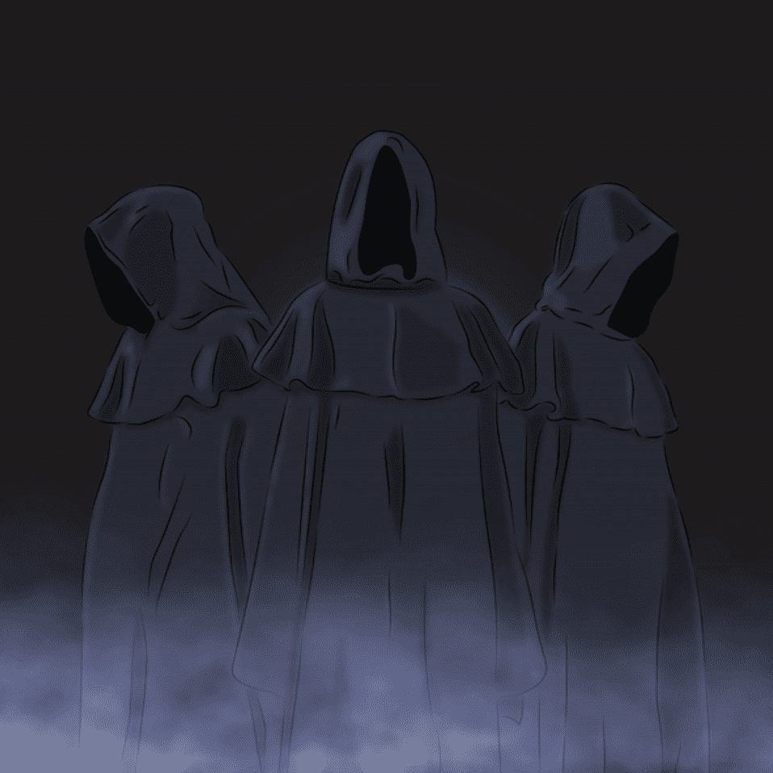

# mysterioustown.wtf

潜伏在阴影中的神秘生物……

1 每个钱包免费。 666 位自由共济会。6,000 名额外神秘教派成员，在 0.002Ξ，ERC-721A 优化。

▶ 什么是神秘小镇.wtf？

Mysterytown.wtf 是一个 NFT (Non-fungible token) 集合。存储在区块链上的数字艺术品集合。

▶ 有多少神秘镇.wtf 代币？

总共有 6,666 个mysterytown.wtf NFT。目前 1,924 位所有者的钱包中至少有一个神秘城.wtf NTF。

▶ 最近卖了多少mysterytown.wtf？

在过去的 30 天内售出了 270 个mysterytown.wtf NFT。

▶ 一个神秘小镇.wtf 需要多少钱？

在过去的 30 天里，mysterytown.wtf 最便宜的 NFT 销售额低于 3 美元，最高销售额超过 18 美元。过去 30 天内，mysterytown.wtf NFT 的中位价格为 4 美元。

▶ 什么是流行的mysterytown.wtf 替代品？

许多拥有mysterytown.wtf NFT 的用户还拥有 [chainknights.xyz](https://www.nft-stats.com/collection/chainknights-xyz)、 [NightmaresByHan](https://www.nft-stats.com/collection/nightmaresbyhan)、 [Quakheads](https://www.nft-stats.com/collection/quakheads)和 [Historic Heathens](https://www.nft-stats.com/collection/historic-heathens)。

