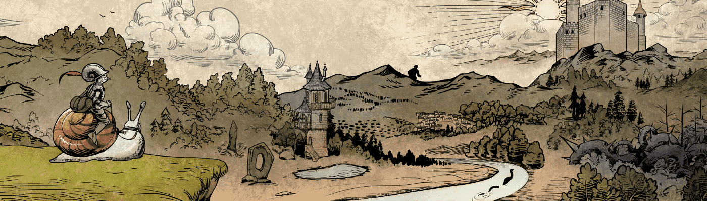

# Mysterra

在神秘的这个勇敢的新世界中遇见这些可爱的奇幻野兽！许多人认为的怪物与自然秩序之间的界限只有在头脑顽固的情况下才会如此粗大。重新发现幻想和未知的奇迹，在它的居民被称为 Mysterra 的地方。

从漫画中了解有关世界及其居民的更多信息。 https://www.instagram.com/milltsart/

▶ 什么是秘境？

Mysterra 是一个 NFT（非同质代币）集合。存储在区块链上的数字艺术品集合。

▶ 存在多少个 Mysterra 代币？

总共有 22 个 Mysterra NFT。目前，31 位所有者的钱包中至少有一个 Mysterra NTF。

▶ 最近卖出了多少 Mysterra？

过去 30 天内售出 0 个 Mysterra NFT。

