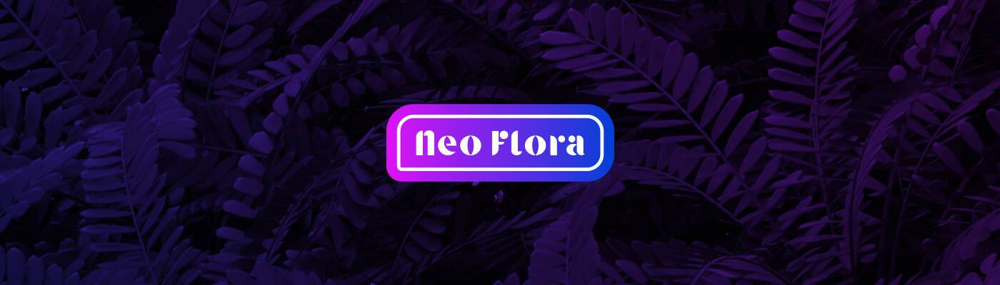

# Neo Flora

这个来自 Bombay Sapphire 的新活动将展示存在于日常生活中的创意灵感，并将展示人们如何重新构建他们的世界以找到更多的创造力。

孟买蓝宝石相信世界是一个画廊。创意灵感无处不在，无处不在。为了检验这个想法，我们正在邀请来自世界各地的创作者向我们展示他们每天的灵感来源。它启发了什么。他们看到了什么，他们做了什么。

表面上看起来不起眼的东西，但却激发了一些美丽的东西。该项目将揭示创作者所看到的并展示人们如何重新构建他们的世界观。证明创造力不在于你看到了什么，而在于你如何看待它。

要求是“向我们展示你所看到的”。向像您一样的创作者公开邀请分享您在现实世界中看到的图像或视频，然后激发您的创作灵感。您制作的内容还需要以相应的图像或视频格式交付。

阅读下面的完整简报，了解我们正在寻找的更多细节！

他们希望看到您的创造力，并将选择 10 件作品作为选定的创作者，每件获得 1,000 英镑。

