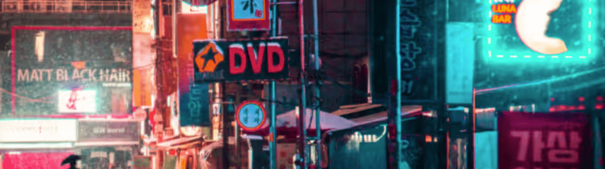

# NEON 363 CLUB

现在公开发售 | 0.009 每个钱包最多 1 个 | 先363免费！！！ Neon363 CLUB 是一个完全去中心化的 CRYPTO PARTY，位于每个持有者所在的地方。 NEON 363 CLUB PROJECT 是我们 Pass NFT，只有 1363 件，永远不会增发。 我们会定期回购和质押代币，以确保NEON363 PASS CARD价格持续上涨和市场供需平衡。

▶ 什么是 NEON 363 CLUB？
NEON 363 CLUB 是一个 NFT（Non-fungible token）集合。存储在区块链上的数字艺术品集合。
▶ NEON 363 CLUB 代币有多少？
总共有 422 个 NEON 363 CLUB NFT。目前，242 位所有者的钱包中至少有一个 NEON 363 CLUB NTF。
▶ NEON 363 CLUB 最贵的售价是多少？
NEON 363 CLUB NFT 售出的最昂贵的是 NEON 363 CLUB。它于 2022 年 6 月 20 日（2 个月前）以 22 美元的价格售出。
▶ NEON 363 CLUB 最近卖出了多少台？
过去 30 天内共售出 14 个 NEON 363 CLUB NFT。
▶ NEON 363 CLUB 需要多少钱？
在过去 30 天内，NEON 363 CLUB NFT 最便宜的销售额低于 2 美元，最高销售额超过 22 美元。过去 30 天 NEON 363 CLUB NFT 的中位价格为 10 美元

