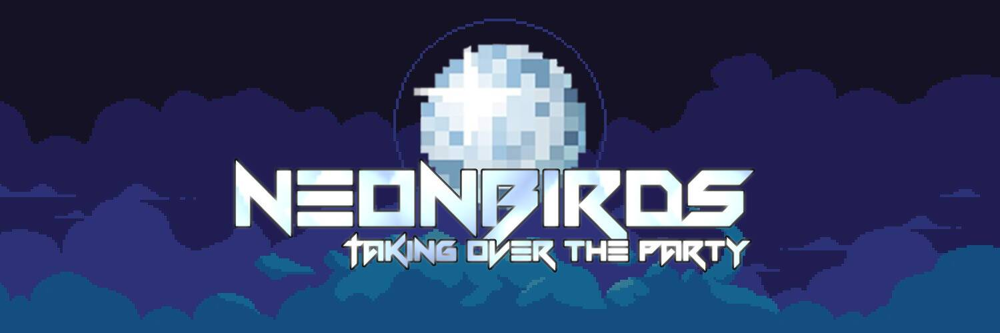

# Neon Birds

过去 7 天没有售出霓虹鸟。

我们来这里是为了让派对开始并玩得开心！

Neon Birds NFT - 常见问题（FAQ）
▶ 什么是霓虹鸟？
Neon Birds 是一个 NFT（非同质代币）集合。存储在区块链上的数字艺术品集合。
▶ 有多少 Neon Birds 代币？
总共有 6,666 个 Neon Birds NFT。目前，922 位车主的钱包中至少有一个 Neon Birds NTF。
▶ 最昂贵的霓虹鸟销售是什么？
最昂贵的 Neon Birds NFT 是 Neonbirds。它于 2022 年 6 月 14 日（2 个月前）以 7 美元的价格售出。
▶ 最近卖出了多少只霓虹鸟？
过去 30 天内售出了 2 个 Neon Birds NFT。
▶ 什么是流行的霓虹鸟替代品？
许多拥有 Neon Birds NFT 的用户还拥有 Lucky LepreKongz、 LilBabyMews、 BloodyApeFromHell和 A Familiar Memory: Chapter 2。
 交互式 NFT 项目：Goofball Gang。立即购买。

