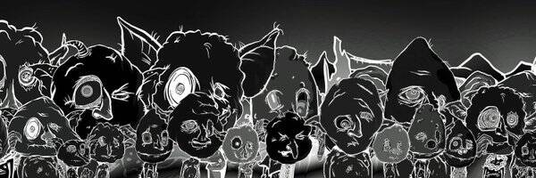

# Neon Goblins

​	过去 7 天没有售出 NOBGOBLINS.wtf。

AAAAYUHUUUUU 叮当，你在做什么？OHAYDER ONEYSNAEKGOBLRS。请在 WEBFRE 笏上对 GOBLEN 魔杖进行 FREEKEN LUBDUBS 吗？HOPYOOMINZ FIRST MONSTAER 脚踝打屁股。就是这样，喜欢你的热狗头发，全是盲人鲍勃。

**NOBGOBLINS.wtf NFT - 常见问题（FAQ）**

▶ 什么是 NOBGOBLINS.wtf？

NOBGOBLINS.wtf 是一个 NFT（不可替代令牌）集合。存储在区块链上的数字艺术品集合。

▶ 存在多少 NOBGOBLINS.wtf 代币？

总共有 1,329 个 NOBGOBLINS.wtf NFT。目前 420 位所有者的钱包中至少有一个 NOBGOBLINS.wtf NTF。

▶ NOBGOBLINS.wtf 最贵的交易是什么？

售出的最昂贵的 NOBGOBLINS.wtf NFT 是 [NOBGOBLIN #554](https://www.nft-stats.com/asset/0x12fe4b4d1c7adb452501be5403d57d4468a545d4/554)。它于 2022-06-08（3 个月前）以 88.8 美元的价格售出。

▶ 最近卖出了多少 NOBGOBLINS.wtf？

过去 30 天内售出了 43 个 NOBGOBLINS.wtf NFT。

▶ NOBGOBLINS.wtf 需要多少钱？

在过去 30 天内，最便宜的 NOBGOBLINS.wtf NFT 销售额低于 25 美元，最高销售额超过 71 美元。过去 30 天 NOBGOBLINS.wtf NFT 的中位价格为 34 美元。

▶ 什么是流行的 NOBGOBLINS.wtf 替代品？

许多拥有 NOBGOBLINS.wtf NFT 的用户还拥有 [EL NUMEROS](https://www.nft-stats.com/collection/elnumeros)、 [DegenOkayBears](https://www.nft-stats.com/collection/degenbears)、 [WaterBe4nZuki](https://www.nft-stats.com/collection/waterbe4nzuki)和 [Old Legacy](https://www.nft-stats.com/collection/old-legacy)。

