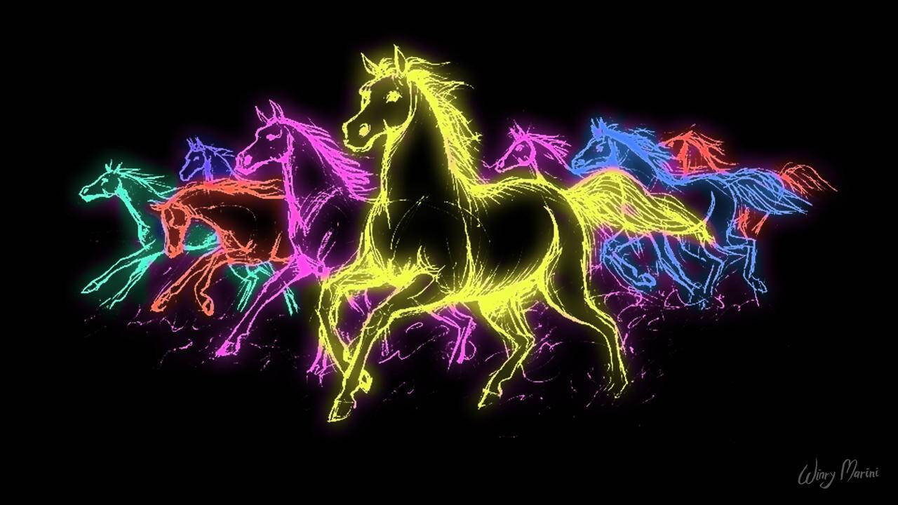

# NeonHorses

过去 7 天没有售出 NeonHorses。

1000 匹艾生成了具有特征的霓虹马。

如果您想要一个特定的，只需从 0.0006 发送一个报价，直到我们完成所有列表

▶ 什么是霓虹马？
NeonHorses 是一个 NFT（非同质代币）集合。存储在区块链上的数字艺术品集合。
▶ 有多少 NeonHorses 代币？
总共有 1,000 个 NeonHorses NFT。目前，37 位车主的钱包中至少有一个 NeonHorses NTF。
▶ 最近卖出了多少 NeonHorse？
过去 30 天内售出 0 个 NeonHorses NFT。

