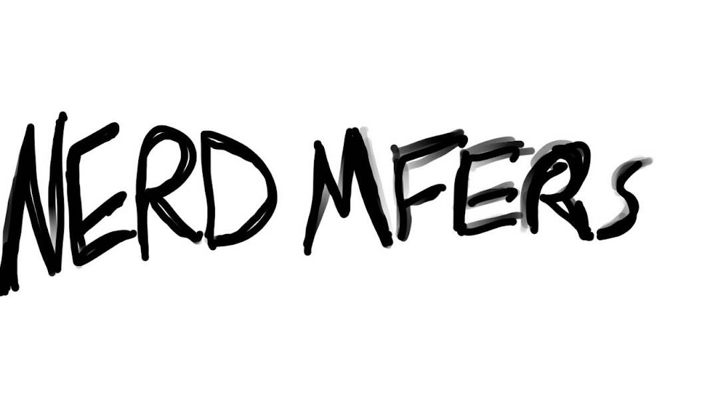

# Nerd Mfers

过去 7 天都没有售出 Nerd Mfer。

一群喜欢 Sartoshi 和 Nerd 相关事物的 nerd mfer，Lets Vibe！

Nerd Mfers NFT - 常见问题（FAQ）
▶ 什么是书呆子 Mfer？
Nerd Mfers 是一个 NFT（不可替代令牌）集合。存储在区块链上的数字艺术品集合。
▶ 有多少 Nerd Mfers 代币？
总共有 316 个 Nerd Mfers NFT。目前，120 位所有者的钱包中至少有一个 Nerd Mfers NTF。
▶ 最近卖出了多少 Nerd Mfer？
过去 30 天内售出 0 个 Nerd Mfers NFT。

**书呆子 Mfers 特征**

**身体**

平均价格：10.8% 猿Mfer：12.7% 红色Mfer：12.3% 蓝色Mfer：11.4% 黄金价格：7.9% 灰色Mfer：8.5% 绿色Mfer：11.1% 紫色Mfer：13.9%

**眼睛**

暴怒率：17.1% 书呆子：20.3% 昏昏欲睡：20.3% Zooted Mfer: 16.8% 专注Mfer：14.2%

**手**

冈兹：5.1% 雅达利：4.7% 武士刀：5.7% 公吨露水：6% 尖叫：7.6% 符文匕首：3.8% 王国之心：6%  巨  刀：5.4% 镀金弯刀：7.9% 决斗时间：7.3% F 代表出色：6.3% 必须抓住他们：4.4% 嘘我妈妈打电话：7.6% 龙匕首加成：5.4% 愿原力与你同在：5.4%

**椅子**

红色玩家椅子：14.9% 蓝色玩家椅子：16.8% 黑色游戏椅：13.6% 白人玩家椅子：13.6% 紫色游戏椅：16.1% 黄色玩家椅子：13.6%

**头巾**

悟空：3.8% 路易吉：5.4% 努鲁托：7.9% 老悟空：7% 马里奥先生：7% 龙珠：8.2% 士官长：3.8% 红党：4.7% 超越赛亚人：4.4% 蓝色派对帽：6.3% 绿色派对帽：5.4% 一个上升 Shroomz: 5.7% 鼠兔咀嚼物：5.4% 魔法蘑菇：6.6% 紫色派对仇恨：7%

