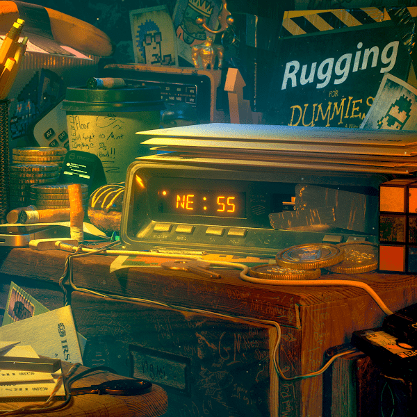

# NessGraphicsVault

25 岁的数字艺术家Alex Ness在广泛的现代媒体中工作，主要以他对 3D 动画、建模和设计的掌握而闻名。从 12 岁起，Ness 就喜欢使用技术通过不同规模的数字故事讲述来吸引他的观众，在全球知名的活动和表演中与屡获殊荣的音乐家一起展示他的视觉艺术。Ness 在他的作品中融入了反乌托邦和赛博朋克永恒的舒缓色彩，并被广泛认为是 NFT 世界的思想领袖。

#2986 - 加密艺术 - 3D 动画 - SuperRare、NiftyGateway、MakersPlace、OpenSea 和苏富比上的音乐会视觉 NFT

