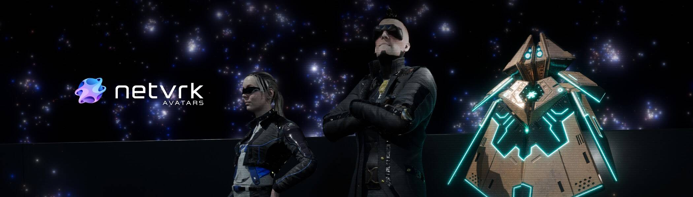

# Netvrk Avatars

Netvrk Avatars NFT 在过去 7 天内售出 1 次。Netvrk Avatars 的总销售额为 786.44 美元。一个 Netvrk Avatars NFT 的平均价格为 786.4 美元。有 442 个 Netvrk Avatars 所有者，总共拥有 1,101 个代币。

Netvrk 是一个建立在区块链上的元宇宙，允许用户通过 NFT 和 Virtual Land 将他们的创作货币化。

Netvrk Avatars NFT - 常见问题（FAQ）
▶ 什么是 Netvrk 头像？
Netvrk Avatars 是一个 NFT（Non-fungible token）集合。存储在区块链上的数字艺术品集合。
▶ 有多少个 Netvrk Avatars 代币？
总共有 1,101 个 Netvrk Avatars NFT。目前，442 位所有者的钱包中至少有一个 Netvrk Avatars NTF。
▶ 最昂贵的 Netvrk Avatars 销售是什么？
售出的最昂贵的 Netvrk Avatars NFT 是 Eve。它于 2022 年 6 月 7 日（3 个月前）以 150 美元的价格售出。
▶ 最近卖出了多少 Netvrk Avatar？
过去 30 天内共售出 14 个 Netvrk Avatars NFT。
▶ Netvrk Avatars 需要多少钱？
过去 30 天，最便宜的 Netvrk Avatars NFT 销售额低于 597 美元，最高销售额超过 1315 美元。过去 30 天内，Netvrk Avatars NFT 的中位价格为 942 美元。
▶ 什么是流行的 Netvrk Avatars 替代品？
许多拥有 Netvrk Avatars NFT 的用户还拥有 Netvrk Bonuses、 Netvrk Transports、 Angry Ape Army Weapons和 CryptoFoxes Origins。

