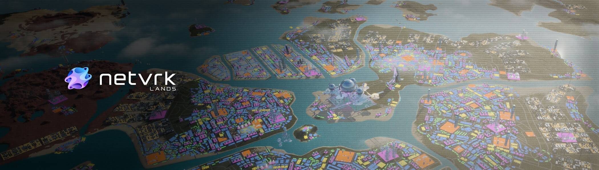

# Netvrk Land

Netvrk Land NFT 在过去 7 天内售出 38 次。Netvrk Land 的总销售额为 33.38 万美元。Netvrk Land NFT 的平均价格为 878.5 美元。有 2,904 名 Netvrk Land 所有者，总共拥有 10,281 个代币。

Netvrk 是一个建立在区块链上的元宇宙，允许用户通过 NFT 和 Virtual Land 将他们的创作货币化。

Netvrk Land NFT - 常见问题（FAQ）
▶ 什么是 Netvrk Land？
Netvrk Land 是一个 NFT（Non-fungible token）集合。存储在区块链上的数字艺术品集合。
▶ 有多少 Netvrk Land 代币？
总共有 10,281 个 Netvrk Land NFT。目前，2,904 位车主的钱包中至少有一个 Netvrk Land NTF。
▶ 最昂贵的 Netvrk 土地出售是什么？
售出的最昂贵的 Netvrk Land NFT 是 Parcel #123。它于 2022 年 6 月 10 日（2 个月前）以 1.79 万美元的价格售出。
▶ 最近售出多少 Netvrk Land？
过去 30 天内共售出 221 个 Netvrk Land NFT。
▶ Netvrk Land 需要多少钱？
过去 30 天，Netvrk Land NFT 最便宜的销售额低于 374 美元，最高销售额超过 1708 美元。过去 30 天内，Netvrk Land NFT 的中位价格为 524 美元。
▶ 有哪些流行的 Netvrk Land 替代品？
许多拥有 Netvrk Land NFT 的用户还拥有 Netvrk Transports、 Netvrk Bonuses、 Netvrk Avatars和 Angry Ape Army Evolution Collection。

