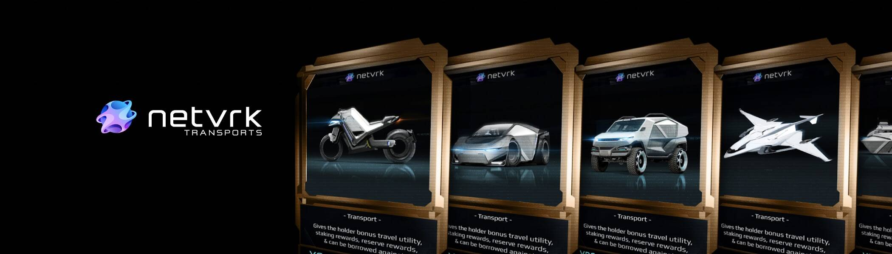

# Netvrk Transports

Netvrk Transports NFT 在过去 7 天内售出 14 次。Netvrk Transports 的总销售额为 3.07 万美元。一份 Netvrk Transports NFT 的平均价格为 219.4 美元。有 1,617 名 Netvrk Transports 所有者，总共拥有 5,589 个代币。

Netvrk 是一个建立在区块链上的元宇宙，允许用户通过 NFT 和 Virtual Land 将他们的创作货币化。

Netvrk Transports NFT - 常见问题（FAQ）
▶ 什么是 Netvrk Transports？
Netvrk Transports 是一个 NFT（Non-fungible token）集合。存储在区块链上的数字艺术品集合。
▶ 有多少 Netvrk Transports 代币？
总共有 5,589 个 Netvrk Transports NFT。目前，1,617 位车主的钱包中至少有一个 Netvrk Transports NTF。
▶ 最昂贵的 Netvrk Transports 销售是什么？
最昂贵的 Netvrk Transports NFT 是 XRS Bullet Yacht。它于 2022 年 6 月 8 日（3 个月前）以 540 美元的价格售出。
▶ 最近售出了多少台 Netvrk Transport？
过去 30 天内售出了 80 个 Netvrk Transports NFT。
▶ Netvrk Transports 的成本是多少？
过去 30 天，最便宜的 Netvrk Transports NFT 销售额低于 88 美元，最高销售额超过 577 美元。过去 30 天内，Netvrk Transports NFT 的中位数价格为 126 美元。
▶ 什么是流行的 Netvrk Transports 替代品？
许多拥有 Netvrk Transports NFT 的用户还拥有 Netvrk Bonuses、 Netvrk Land、 Netvrk Avatars和 MartiansVSRednecks。

