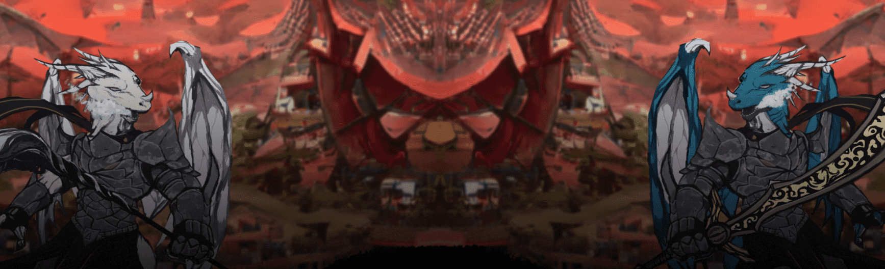

# Never Dead Dragons

过去 7 天内没有售出永不死龙。

Never Dead Dragons NFT 是 2,000 条龙的集合，可让您访问我们的 P2E 视频游戏、创新的代币经济学、质押机制和每周节点赠品。

Never Dead Dragons NFT - 常见问题（FAQ）
▶ 什么是永不死的龙？
Never Dead Dragons 是一个 NFT（非同质代币）集合。存储在区块链上的数字艺术品集合。
▶ 有多少永不死龙代币？
总共有 262 个 Never Dead Dragons NFT。目前，84 位所有者的钱包中至少有一个 Never Dead Dragons NTF。
▶ 最近卖出了多少只永不死的龙？
过去 30 天内共售出 0 个 Never Dead Dragons NFT。

