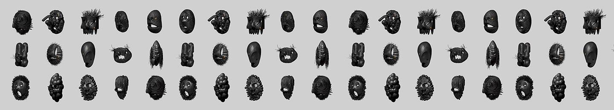

# New Face

新面孔统计:

过出售的 NFT:0     交易量:$0    平均价格:$-    底价(最低要价):X0.9    总供应量(代币数量):107

拥有者(业主数量):36去 7 天没有售出新面孔。

做自己，戴口罩！

New Face NFT - 常见问题（FAQ）
▶ 什么是新面孔？
New Face 是一个 NFT（非同质代币）集合。存储在区块链上的数字艺术品集合。
▶ 新面孔代币有多少？
总共有 107 个 New Face NFT。目前，36 位所有者的钱包中至少有一个 New Face NTF。
▶ 最近卖出了多少新面孔？
过去 30 天内售出 0 个 New Face NFT。

