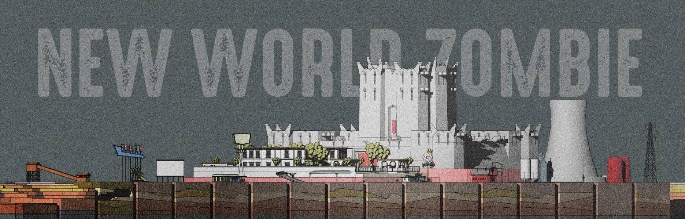

# New World Zombie - The Metaverse

New World Zombie - The Metaverse NFTs 在过去 7 天内售出 1 次。New World Zombie - The Metaverse 的总销量为 $63.34。一个 New World Zombie - The Metaverse NFT 的平均价格为 63.3 美元。有 105 名 New World Zombie - The Metaverse 所有者，总共拥有 372 个代币。

欢迎来到新世界僵尸！

当您将 BZC Zombies 放入即将到来的 Strongholds 大逃杀游戏中时，您将永远不一样。在您导航时，让您的朋友与您的敌人更近，不仅是生存，而且是全力以赴的战争。你会被加冕为最终的赢家，还是会像其他人一样让你吃尽苦头？

这个系列是即将到来的新世界僵尸游戏的土地！

新世界僵尸 - 元界 NFT - 常见问题（FAQ）
▶ 什么是新世界僵尸 - 元宇宙？
New World Zombie - The Metaverse 是一个 NFT（不可替代令牌）集合。存储在区块链上的数字艺术品集合。
▶ 新世界僵尸 - 元界代币有多少？
总共有 372 个 New World Zombie - The Metaverse NFT。目前，105 位所有者的钱包中至少有一个新世界僵尸 - 元界 NTF。
▶ 什么是最昂贵的 New World Zombie - The Metaverse 销售？
最昂贵的 New World Zombie - The Metaverse NFT 是 New World Zombie - The Metaverse #3284。它于 2022 年 6 月 13 日（2 个月前）以 129.5 美元的价格售出。
▶ 最近卖出了多少新世界僵尸 - 元界？
过去 30 天内售出了 11 个 New World Zombie - The Metaverse NFT。
▶ 新世界僵尸 - 元界需要多少钱？
过去 30 天，最便宜的 New World Zombie - The Metaverse NFT 销售额低于 54 美元，最高销售额超过 156 美元。过去 30 天内，New World Zombie - The Metaverse NFT 的中位价格为 66 美元。
▶ 什么是流行的 New World Zombie - The Metaverse 替代品？
许多拥有 New World Zombie-The Metaverse NFT 的用户还拥有 David Ariew Interleave Artwork、 Labo Pupz、 BZC Metaverse Collection和 The Cyborg Werewolves。

