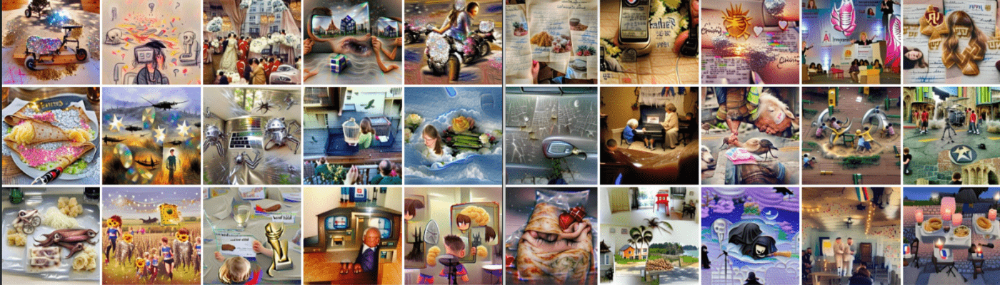

# NewDayTomorrow

过去 7 天没有售出 NewDayTomorrow。

一系列 MemoryGRAMS Unique 1/1 艺术品，灵感来自您的记忆。

我们收集了你的记忆——童年记忆、令人振奋和令人沮丧的记忆，以及代代相传的记忆——并将它们输入一个名为 MNEMOS 的人工智能大脑，以希腊记忆女神 Mnemosyne 命名。MNEMOS 是 VQGAN-CLIP 算法的一个版本，已经经过数百万个时刻的训练。

MNEMOS 将深刻而强烈的记忆转化为引人入胜、令人难以忘怀的怀旧艺术作品，命名为 MemoryGRAM 或 Generated Random Art Memories。具有讽刺意味的是，正是通过一台机器，我们才能探索我们的同理心。

触发警告：以下一些 MemoryGRAM 包含与死亡、精神疾病、成瘾、虐待、战争、种族主义和血腥相关的文字和图像，这可能会让一些观众感到痛苦。

NewDayTomorrow NFT - 常见问题（FAQ）
▶ 什么是NewDayTomorrow？
NewDayTomorrow 是一个 NFT（非同质代币）集合。存储在区块链上的数字艺术品集合。
▶ 有多少 NewDayTomorrow 代币？
总共有 459 个 NewDayTomorrow NFT。目前，322 位所有者的钱包中至少有一个 NewDayTomorrow NTF。
▶ NewDayTomorrow 最贵的促销是什么？
最昂贵的 NewDayTomorrow NFT 是 使用多种颜色，将它们倒在一块大的白色画布上，感觉颜料从我的手指间流过。. 它于 2022 年 6 月 22 日（2 个月前）以 11 美元的价格售出。
▶ 最近卖出了多少 NewDayTomorrow？
过去 30 天内售出了 3 个 NewDayTomorrow NFT。
 交互式 NFT 项目：Goo

