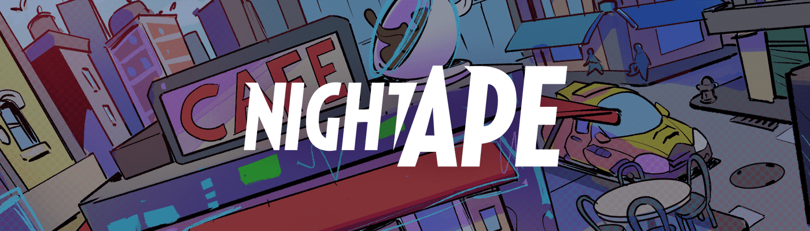

# Non-Fungible Heroes Comics

过去 7 天没有售出不可替代的英雄漫画。

每个故事都需要一个冠军：因此夜猿诞生了，我们的主角和第一个传奇人物，我们故事应得的城市英雄。我们的社区和艺术家共同努力，将这个宇宙带给您，这证明了协作讲故事的力量。我们希望您喜欢阅读本文，就像我们喜欢创作它一样。

Non-Fungible Heroes Comics NFT - 常见问题（FAQ）
▶ 什么是不可替代的英雄漫画？
Non-Fungible Heroes Comics 是一个 NFT（Non-fungible token）系列。存储在区块链上的数字艺术品集合。
▶ 存在多少不可替代英雄漫画代币？
总共有 2,484 个不可替代英雄漫画 NFT。目前，874 位所有者的钱包中至少有一本 Non-Fungible Heroes Comics NTF。
▶ 什么是最昂贵的不可替代英雄漫画销售？
最昂贵的 Non-Fungible Heroes Comics NFT 是 Non-Fungible Heroes Comics 1649。它于 2022-06-16（2 个月前）以 85.5 美元的价格售出。
▶ 最近卖出了多少部不可替代的英雄漫画？
过去 30 天内售出了 6 份 Non-Fungible Heroes Comics NFT。
▶ 什么是流行的不可替代英雄漫画替代品？
许多拥有 Non-Fungible Heroes Comics NFT 的用户还拥有 0xHEADS、 Catty Corner、 Monochrome Rainbow-Manga 插图和 The Unchained Mouflons。

