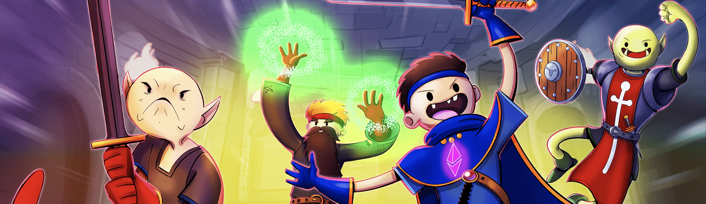

# NFT Dungeon

NFT Dungeon™ Core Set 包含来自 NFT Dungeon 的 12K 生成的 RPG 冒险家。这些数字收藏品可用于您自己的桌面游戏。您的 NFT 也是 Tarf's Tavern 的独家会员资格，并有机会参与未来的特卖和惊喜掉落。NFT Dungeon™ 是 Sam Ellis 的商标，但他将大部分使用权授予代币持有者，再次请不要将它们许可出去。NFT Dungeon © 对代币持有者免费。

▶ 什么是 NFT 地牢创始人套装？
NFT Dungeon Founder's Set 是一个 NFT (Non-fungible token) 集合。存储在区块链上的数字艺术品集合。
▶ NFT Dungeon Founder's Set 代币有多少？
总共有 1,046 个 NFT Dungeon Founder's Set NFT。目前，401 位所有者的钱包中至少有一个 NFT Dungeon Founder's Set NTF。

