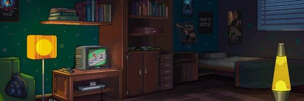

# NFTBOY: Bored Ape Racers

NFTBOY: Bored Ape Racers NFT 在过去 7 天内售出 1 次。NFTBOY：Bored Ape Racers 的总销售额为 21.1 美元。NFTBOY：Bored Ape Racers NFT 的平均价格为 21.1 美元。共有 891 名 NFTBOY：Bored Ape Racers 所有者，总共拥有 2,777 个代币。

可收藏的墨盒 NFT 系列，定期发布并与可玩的复古街机游戏配对。

Bored Ape Racers 向 Bored Ape 游艇俱乐部和 1992 年和 2001 年发布的经典超级马里奥赛车和马里奥赛车超级赛道游戏致敬。

NFTBOY：无聊的猿赛车 NFT - 常见问题（FAQ）
▶ 什么是 NFTBOY：无聊的猿人赛车手？
NFTBOY: Bored Ape Racers 是一个 NFT（不可替代代币）系列。存储在区块链上的数字艺术品集合。
▶ 存在多少 NFTBOY: Bored Ape Racers 代币？
总共有 2,777 个 NFTBOY：Bored Ape Racers NFT。目前，891 位车主的钱包里至少有一个 NFTBOY：Bored Ape Racers NTF。
▶ 最贵的 NFTBOY：Bored Ape Racers 特卖是什么？
最昂贵的 NFTBOY：Bored Ape Racers NFT 是 NFTBOY Cartridge：Bored Ape Racers - #790。它于 2022-08-18（6 天前）以 21.1 美元的价格售出。
▶ NFTBOY: Bored Ape Racers 最近卖出了多少？
过去 30 天内售出了 1 个 NFTBOY：Bored Ape Racers NFT。

