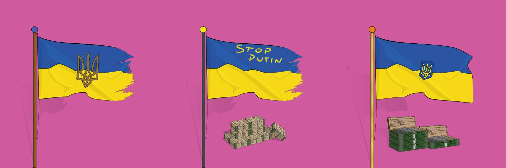

# NftdonationUKR

过去 7 天没有售出 NftdonationUKR。

捐赠给乌克兰以获得白名单。10.000 个独特的旗帜，只有捐赠者才有资格购买。#motivatetodonate #supportukraine #showsupport

如何：-捐赠给@Ukraine 官方加密地址： https ://donate.thedigital.gov.ua/ https://twitter.com/Ukraine/status/1497594592438497282?s=20&t=2bkoVd_RxAelxQDWmJt8WA ETH 和 USDT (ERC-20 ) - 0x165CD37b4C644C2921454429E7F9358d18A45e14

- 将您的交易作为回复发布，并将地址列入白名单https://twitter.com/NftdonationUKR/status/1504540203448516608

- 在https://opensea.io/collection/nftdonationukr上获取您独特的 NFT 标志

NftdonationUKR NFT - 常见问题（FAQ）
▶ 什么是 NftdonationUKR？
NftdonationUKR 是一个 NFT（不可替代代币）集合。存储在区块链上的数字艺术品集合。
▶ 有多少 NftdonationUKR 代币？
总共有 100 个 NftdonationUKR NFT。目前 2 位所有者的钱包中至少有一个 NftdonationUKR NTF。
▶ 最近卖出了多少 NftdonationUKR？
在过去 30 天内售出了 0 个 NftdonationUKR NFT。

