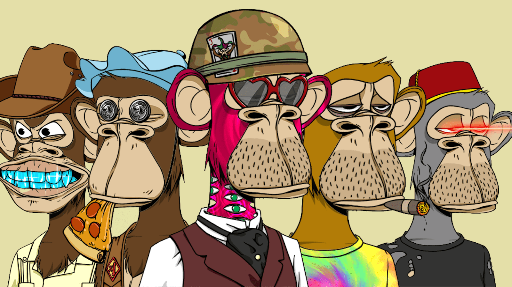

# Nike x Bored Ape Yacht Club

Bored Ape Yacht Club NFT 在过去 7 天内售出 67 次。 Bored Ape Yacht Club 的总销售额为 816 万美元。一艘 Bored Ape Yacht Club NFT 的平均价格为 12.18 万美元。 Bored Ape Yacht Club 拥有 6,441 名所有者，总供应量为 10,000 个代币。▶ 什么是无聊猿游艇俱乐部？
Bored Ape Yacht Club 是一个 NFT（非同质代币）系列。存储在区块链上的数字艺术品集合。
▶ 有多少无聊猿游艇俱乐部代币？
总共有 10,000 个 Bored Ape Yacht Club NFT。目前，6,441 位船主的钱包中至少有一个 Bored Ape Yacht Club NTF。
▶ Bored Ape Yacht Club 最贵的拍卖会是什么？
最昂贵的 Bored Ape Yacht Club NFT 是 .它于 2022-08-17（6 天前）以 110 万美元的价格售出。

