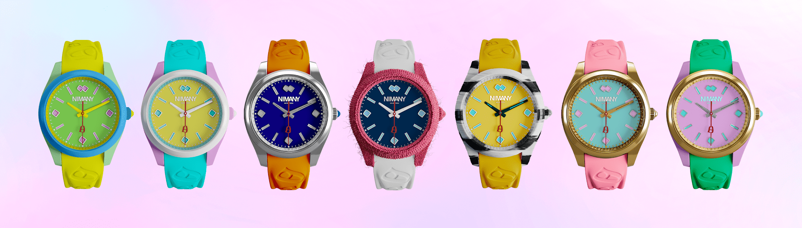

# NIMANY Club (Season 1)

🕐 NIMANY 俱乐部（第 1 季）🕔🕓 第 1 季：独特的 NFT 手表，由 NIMANY 制作🕑▶ 什么是 NIMANY 俱乐部（第 1 季）？
NIMANY Club (Season 1) 是一个 NFT (Non-fungible token) 集合。存储在区块链上的数字收藏品集合。
▶ NIMANY Club (Season 1) 代币有多少？
第 8 位 NI MAN 267MANY 俱乐部（第 1 季）。 目前，7 辆车主的中场至少有一个俱乐部（Season）NTF。
▶ NIMANY Club (Season 1) 最昂贵的销售是什么？
出卖最贵的 NIMANY Club（第 1 季）NFT 是 NIMANY Club S1 #0226。它于 2022 年 6 月 13 日（2 个月前）以 216.1 美元的价格售出。
▶ NIMANY Club (第一季)最新推出了多少？
过去 30 件 NI 卖出 1Y 件 2 件 NFT。

