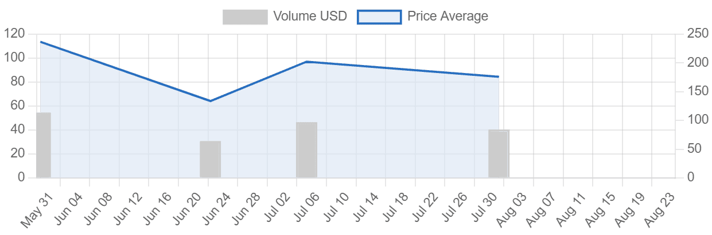

# The Nincomputers

过去7天没有售出nincomputer。区块链都是他们手工制作的，完全链上。nincomputers NFT - 常见问题（FAQ）
▶ 什么是 nincomputers？
nincomputers 是一个 NFT 标记（不可替代）集合。在区块链上的数字收藏品集合。
▶ 有多少代币？
电脑有，35个电脑N个，目前有30个电脑有N个。
▶最近多少台电脑？
过去 30 台 NFT 提供 1 台。NFT stat 为您提供相关的最新空间。新闻。
本网站上的数据来自各种 NFT 市场和 NFT 项目创建者自己。我们还直接从 Twitter 和 Discord 获取 NFT 社区统计数据。

