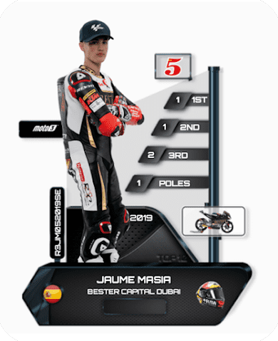

# MotoGP NinjaStickers

MotoGP™、Moto2™、Moto3™ 和这项运动的传奇。来看看你在 https://www.ninjastickers.com/motogp-ethereum/ 上的贴纸，这些贴纸集成在他们的相册中。专辑分为 8 个类别：6 个类别用于季节，1 个类别用于传奇和电路。过去 7 天内没有任何 MOTORBIKE RACER 销售。

这是一个加密摩托车赛车手

受加密货币和 MotoGP 摩托车比赛的启发 比较硬币的价格波动以成为摩托车比赛的格式

“加密骑士系列”▶ 什么是摩托车赛车手？

MOTORBIKE RACER 是一个 NFT（非同质代币）集合。存储在区块链上的数字艺术品集合。

