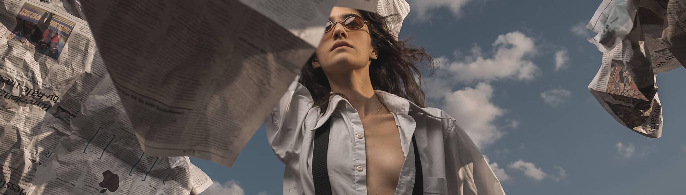

# There is Nothing New Under The Sky

当人们摆脱自己陷入的恶性循环时，生活的单调就会结束。只有在那一刻，才能质疑天底下是否有新事物。生命不止于天空之下。于是，我们冲破城墙，回归自然。来区分。要记住摄影叙事，每一个都表现出自己的叛逆或情感差异，指的是自然界中独立的人的扭曲和适应努力。该系列包括 15 幅摄影叙事。每件作品是 1/1 许可：包括详细的编辑和商业权利在每个 NFT 的描述中

