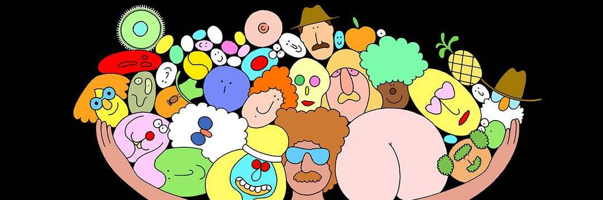

# No Falafel Today by Mrzyk & Moriceau

没有 Mrzyk & Moriceau | 过去 7 天内没有今天出售的沙拉三明治。

自从他们第一次在法国坎佩尔美术学院相遇以来，他们就通过绘画团结起来，这对二人组 Mrzyk 和 Moriceau 探索了我们未制定的幻想，并将它们转化为一个补品和不断增长的宇宙。带着幽默和色情色彩，他们的流行视野迅速跨越了当代艺术界，吸引了音乐和广告界。他们的风格在上千人中广为人知，由圆形、柔软和有弹性的形状制成，对他知之甚少 - 但我们相信他来自 70 年代（穿着他的标志性来回、墨镜、小胡子和袜子）。这是我们最好的猜测——但说实话我们不知道。我们喜欢这样。人们可以自行决定这个神秘人是谁，他做了什么，以及他来自哪里。

我们一直被变形、并置、荒谬、超现实主义和神秘所吸引。但以一种有趣的方式。我们想娱乐人们，每幅画都讲述一个独特而有趣的故事。这个故事是由观众决定的。”

