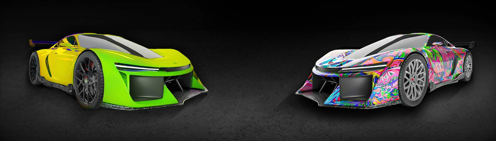

# No Hesi Car Club

No Hesi Car 俱乐部是从未见过的超级跑车的独家团体。作为持有者，您可以访问他们的 Metaverse 岛并参加比赛以获得游戏。持有者还可以访问整个 No Hesi 生态系统，其中包括 IRL 体验、产品和合作伙伴关系。No Hesi Car Club NFT - 常见问题（FAQ）

##### ▶ 什么是无河西车会？

No Hesi Car Club 是一个 NFT（Non-fungible token）集合。存储在区块链上的数字艺术品集合。

##### ▶ No Hesi Car Club 代币有多少？

总共有 300 个 No Hesi Car Club NFT。目前有 141 位车主的钱包里至少有一辆 No Hesi Car Club NTF。

##### ▶ 无和思车社最近卖出了多少辆？

过去 30 天内售出 0 个 No Hesi Car Club NFT。

##### ▶ 什么是流行的 No Hesi Car Club 替代品？

许多拥有 No Hesi Car Club NFT 的用户还拥有 [Non Fungible Films Membership Pass](https://www.nft-stats.com/collection/nff-membership-pass)、

